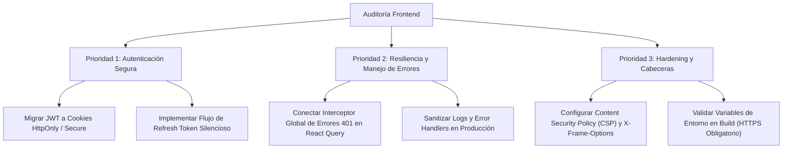

# Informe de Auditoría de Seguridad — Frontend (`apps/web`)

**Fecha de Evaluación:** 03 de Octubre de 2026  
**Objetivo:** Aplicación Web de Gestión CentralPC (`apps/web`)  
**Tecnologías:** React 19, Vite, TanStack Router & Query, tRPC Client, Tailwind CSS, Zod.

---

## 1. Resumen Ejecutivo

Se ha realizado una auditoría exhaustiva de seguridad sobre la base de código del módulo frontend (`apps/web`). El análisis cubrió el flujo de autenticación, manejo de tokens de sesión, almacenamiento local, comunicación tRPC con la API, gestión de errores, control de acceso basado en roles (RBAC) en interfaz y configuración de seguridad del cliente.

A continuación se detallan los hallazgos clasificados por severidad, explicando su causa raíz, el impacto potencial en entornos de producción y las soluciones recomendadas.

---

## 2. Matriz de Hallazgos

| ID | Hallazgo / Vulnerabilidad | Severidad | Archivo(s) afectado(s) |
|---|---|---|---|
| **SEC-01** | Almacenamiento de Tokens JWT en `localStorage` (Exposición a XSS) | **Alta** | [`src/lib/api.ts`](./src/lib/api.ts) |
| **SEC-02** | Validación y Decodificación Manual de JWT en Frontend (`atob`) | **Media** | [`src/lib/api.ts`](./src/lib/api.ts) |
| **SEC-03** | Fallback Inseguro a HTTP no Cifrado (`http://localhost:3000`) | **Media** | [`src/lib/api.ts`](./src/lib/api.ts) |
| **SEC-04** | Manejador Global de Errores `UNAUTHORIZED` Desconectado | **Media** | [`src/trpc/client.ts`](./src/trpc/client.ts), [`src/main.tsx`](./src/main.tsx) |
| **SEC-05** | Fuga de Información Técnica en Logs de Consola (`console.error`) | **Baja** | Múltiples rutas y componentes |
| **SEC-06** | Fuga de Memoria y Falta de Aislamiento en Visor de PDF (`blobUrl`) | **Baja** | [`src/lib/api.ts`](./src/lib/api.ts) |
| **SEC-07** | Ausencia de Políticas de Cabeceras de Seguridad (CSP, Clickjacking) | **Media** | [`index.html`](./index.html) |
| **SEC-08** | Verificación de Roles Exclusiva en la Interfaz (RBAC UI-Only) | **Media / Informativa** | [`src/routes/_authed/orders/$orderId.tsx`](./src/routes/_authed/orders/$orderId.tsx) |
| **SEC-09** | Carencia de Renovación Automática de Sesión (Refresh Token Flow) | **Baja** | [`src/lib/api.ts`](./src/lib/api.ts), [`src/trpc/client.ts`](./src/trpc/client.ts) |

---

## 3. Detalle de Vulnerabilidades y Mitigaciones

---

### SEC-01: Almacenamiento de Tokens JWT en `localStorage`

- **Severidad:** Alta
- **Ubicación:** [`apps/web/src/lib/api.ts` (Líneas 5-16)](./src/lib/api.ts#L5-L16)
- **Error identificado:**  
  El token JWT de autenticación se persiste y lee directamente desde `localStorage` (`localStorage.setItem("token", ...)` y `localStorage.getItem("token")`).

- **¿Qué lo causa?**  
  La arquitectura actual delega el almacenamiento de la sesión al cliente usando la Web Storage API sin aislamiento frente al contexto de ejecución de scripts de JavaScript.

- **¿Qué puede causar en producción?**  
  Cualquier vulnerabilidad de tipo **Cross-Site Scripting (XSS)** —originada por dependencias npm de terceros comprometidas, inyecciones en el DOM o extensiones maliciosas del navegador— permite que un script atacante lea directamente `localStorage.getItem("token")`. Esto resulta en el **secuestro total de la cuenta (Account Takeover)** y robo de identidad del usuario activo, permitiendo realizar operaciones arbitrarias en la API sin el consentimiento del usuario.

- **Solución recomendada:**  
  1. **Migración a Cookies `HttpOnly`:** Configurar el backend para emitir el token de sesión en una cookie con flags `HttpOnly`, `Secure` y `SameSite=Lax` (o `Strict`), impidiendo que JavaScript en el navegador pueda leerla.
  2. **Configuración de tRPC/Fetch:** Configurar el cliente tRPC y las llamadas `fetch` con `credentials: "include"` o `credentials: "same-origin"` para que el navegador adjunte automáticamente la cookie sin exponerla al frontend.
  3. **Mitigación temporal:** Si se mantiene en memoria, almacenar el token en una variable de estado en memoria (in-memory) durante la sesión activa.

---

### SEC-02: Validación y Decodificación Manual de JWT en Frontend (`atob`)

- **Severidad:** Media
- **Ubicación:** [`apps/web/src/lib/api.ts` (Líneas 17-29)](./src/lib/api.ts#L17-L29)
- **Error identificado:**  
  La función `isTokenExpired` intenta parsear la firma y carga útil del JWT usando `atob()` y `JSON.parse()` casero, validando el campo `exp` contra `Date.now()`.

- **¿Qué lo causa?**  
  Implementación manual de decodificación base64url que asume que el token no contiene caracteres Unicode multibyte y confía ciegamente en el reloj del sistema del usuario.

- **¿Qué puede causar en producción?**  
  - **Fallo por caracteres especiales:** `atob()` lanza una excepción `DOMException` ante secuencias UTF-8 no estándar, provocando que la aplicación interprete erróneamente un token válido como corrupto y desloguee al usuario.
  - **Desincronización horaria:** Si el reloj del cliente tiene un desfase (muy común en equipos locales desincronizados), la sesión puede cerrarse antes de tiempo o intentar peticiones fallidas al servidor.
  - **Sensación falsa de seguridad:** La decodificación en cliente no valida la firma criptográfica del token.

- **Solución recomendada:**  
  1. Derivar la validez de la sesión a través de la consulta al endpoint `trpc.auth.me.useQuery()`, delegando la verificación criptográfica al servidor.
  2. Si se requiere inspeccionar el token en el cliente, utilizar una librería probada y estandarizada como `jwt-decode` que soporte decodificación segura de caracteres UTF-8.

---

### SEC-03: Fallback Inseguro a HTTP no Cifrado (`http://localhost:3000`)

- **Severidad:** Media
- **Ubicación:** [`apps/web/src/lib/api.ts` (Líneas 1-3)](./src/lib/api.ts#L1-L3)
- **Error identificado:**  
  `getApiUrl()` utiliza como valor por defecto la URL sin cifrar `http://localhost:3000` si la variable de entorno `VITE_API_URL` no está definida.

- **¿Qué lo causa?**  
  Ausencia de validación estricta de variables de entorno en el pipeline de build para entornos de producción.

- **¿Qué puede causar en producción?**  
  Si por un error de configuración en el despliegue (Docker, Vercel, Netlify, Nginx) se omite `VITE_API_URL`, la aplicación en producción intentará comunicarse por HTTP hacia localhost, lo que generará:
  - Bloqueo por **Mixed Content** en navegadores modernos (sitio HTTPS intentando contactar endpoint HTTP).
  - En redes locales compartidas, posible transmisión de credenciales y tokens en texto plano si un servicio local responde en el puerto 3000.

- **Solución recomendada:**  
  Validar las variables de entorno en tiempo de compilación o arranque mediante un esquema estricto:
  ```ts
  export function getApiUrl(): string {
    const url = import.meta.env.VITE_API_URL;
    if (!url && import.meta.env.PROD) {
      throw new Error("CRITICAL: VITE_API_URL is not defined in production environment.");
    }
    return url || "http://localhost:3000";
  }
  ```

---

### SEC-04: Manejador Global de Errores `UNAUTHORIZED` Desconectado

- **Severidad:** Media
- **Ubicación:** [`apps/web/src/trpc/client.ts` (Líneas 25-31)](./src/trpc/client.ts#L25-L31), [`apps/web/src/main.tsx`](./src/main.tsx)
- **Error identificado:**  
  Existe una función `handleTrpcError(error)` para capturar errores 401/UNAUTHORIZED y limpiar el token, pero **no está registrada ni conectada** a los enlaces de tRPC ni a la configuración del `QueryClient`.

- **¿Qué lo causa?**  
  Definición de función auxiliar que quedó huérfana y no fue vinculada a los hooks o callbacks de ciclo de vida de React Query.

- **¿Qué puede causar en producción?**  
  Cuando el token de un usuario expira o es revocado mientras navega:
  - Las consultas en segundo plano fallan silenciosamente.
  - La interfaz de usuario muestra componentes en blanco o mensajes de error dispersos en lugar de redirigir limpiamente al login.
  - El token inválido permanece en `localStorage` hasta que el usuario recarga manualmente la página.

- **Solución recomendada:**  
  Integrar el manejador en la configuración central de `QueryClient` en [`src/main.tsx`](./src/main.tsx):
  ```ts
  import { QueryCache, MutationCache, QueryClient } from "@tanstack/react-query";
  import { handleUnauthorized } from "@/lib/api";

  const queryClient = new QueryClient({
    queryCache: new QueryCache({
      onError: (error: any) => {
        if (error?.data?.code === "UNAUTHORIZED" || error?.message?.includes("UNAUTHORIZED")) {
          handleUnauthorized();
        }
      },
    }),
    mutationCache: new MutationCache({
      onError: (error: any) => {
        if (error?.data?.code === "UNAUTHORIZED" || error?.message?.includes("UNAUTHORIZED")) {
          handleUnauthorized();
        }
      },
    }),
  });
  ```

---

### SEC-05: Fuga de Información Técnica en Logs de Consola (`console.error`)

- **Severidad:** Baja
- **Ubicación:**  
  - [`src/routes/login.tsx` (Línea 54)](./src/routes/login.tsx#L54)
  - [`src/routes/_authed/catalog/new.tsx` (Línea 71)](./src/routes/_authed/catalog/new.tsx#L71)
  - [`src/components/orders/ClientSelector.tsx` (Línea 52)](./src/components/orders/ClientSelector.tsx#L52)
  - [`src/components/payments/PaymentForm.tsx` (Línea 66)](./src/components/payments/PaymentForm.tsx#L66)
- **Error identificado:**  
  Uso indiscriminado de `console.error(error.message)` en callbacks `onError` de mutaciones.

- **¿Qué lo causa?**  
  Técnicas de depuración en desarrollo que no fueron removidas o condicionadas al entorno de producción.

- **¿Qué puede causar en producción?**  
  Cualquier usuario con acceso a las Herramientas de Desarrollador (F12) puede inspeccionar mensajes de error que revelen detalles de la base de datos, nombres de tablas, restricciones de integridad o lógica interna de validación del backend.

- **Solución recomendada:**  
  1. Condicionar los logs al entorno de desarrollo:
     ```ts
     if (import.meta.env.DEV) {
       console.error(error);
     }
     ```
  2. Implementar un capturador de errores centralizado (por ejemplo, Sentry o Datadog) para producción que no exponga detalles en la consola local del cliente.

---

### SEC-06: Fuga de Memoria y Falta de Aislamiento en Visor de PDF (`blobUrl`)

- **Severidad:** Baja
- **Ubicación:** [`apps/web/src/lib/api.ts` (Líneas 48-74)](./src/lib/api.ts#L48-L74)
- **Error identificado:**  
  La función `openOrderPdf` genera un enlace blob con `URL.createObjectURL(blob)` y lo abre con `window.open(blobUrl, "_blank")`, sin revocar el objeto en memoria ni especificar banderas de aislamiento de ventana.

- **¿Qué lo causa?**  
  No invocar `URL.revokeObjectURL(blobUrl)` tras la carga del recurso y no pasar parámetros `noopener,noreferrer` a `window.open`.

- **¿Qué puede causar en producción?**  
  - **Memory Leak:** En puestos de trabajo donde los técnicos abren decenas de órdenes al día, los Blobs permanecen en la memoria RAM de la pestaña indefinidamente hasta que se cierra el navegador.
  - **Reverse Tabnabbing:** En navegadores desactualizados, una ventana abierta sin `noopener` puede tener acceso a `window.opener`.

- **Solución recomendada:**  
  Liberar la memoria y añadir protección de apertura:
  ```ts
  export async function openOrderPdf(orderId: number): Promise<void> {
    // ... obtención del blob
    const blob = await response.blob();
    const blobUrl = URL.createObjectURL(blob);
    const newWindow = window.open(blobUrl, "_blank", "noopener,noreferrer");
    
    // Revocar el objeto después de que la ventana lo haya cargado
    setTimeout(() => {
      URL.revokeObjectURL(blobUrl);
    }, 10000);
  }
  ```

---

### SEC-07: Ausencia de Políticas de Cabeceras de Seguridad (CSP, Clickjacking)

- **Severidad:** Media
- **Ubicación:** [`apps/web/index.html`](./index.html)
- **Error identificado:**  
  El archivo HTML raíz no incluye metaetiquetas de Content Security Policy (CSP), ni directivas de protección contra Clickjacking o MIME sniffing.

- **¿Qué lo causa?**  
  Plantilla base generada por Vite que no incorpora políticas de seguridad por defecto para despliegues web.

- **¿Qué puede causar en producción?**  
  - **Clickjacking:** La aplicación puede ser incrustada en un `<iframe>` transparente en un sitio malicioso para engañar al usuario e inducirlo a hacer clic en acciones destructivas (anular órdenes, alterar pagos).
  - **XSS no restringido:** Ausencia de una directiva CSP que restrinja los orígenes permitidos para scripts (`script-src`), estilos (`style-src`) y conexiones (`connect-src`).

- **Solución recomendada:**  
  1. Configurar las siguientes cabeceras HTTP en el servidor web (Nginx / Cloudflare / Vercel):
     - `Content-Security-Policy: default-src 'self'; connect-src 'self' https://api.centralpc.pe; script-src 'self'; style-src 'self' 'unsafe-inline'; frame-ancestors 'none';`
     - `X-Frame-Options: DENY`
     - `X-Content-Type-Options: nosniff`
     - `Referrer-Policy: strict-origin-when-cross-origin`
     - `Strict-Transport-Security: max-age=31536000; includeSubDomains`
  2. Como respaldo en [`index.html`](./index.html), añadir metaetiquetas de protección básica.

---

### SEC-08: Verificación de Roles Exclusiva en la Interfaz (RBAC UI-Only)

- **Severidad:** Media / Informativa
- **Ubicación:** [`apps/web/src/routes/_authed/orders/$orderId.tsx` (Líneas 161-164)](./src/routes/_authed/orders/$orderId.tsx#L161-L164)
- **Error identificado:**  
  La lógica de permisos (`isAdmin = user?.rol === "admin"`) se utiliza para condicionar la visibilidad de botones críticos como *"Anular Orden"* o *"Asignar Técnico"*.

- **¿Qué lo causa?**  
  Diseño de interfaz de usuario donde se ocultan acciones no permitidas según el rol del usuario conectado.

- **¿Qué puede causar en producción?**  
  Si el backend (`@central-pc/api`) no cuenta con middlewares estrictos que verifiquen el rol del usuario en cada procedimiento tRPC (`orders.anular`, `orders.assignTechnician`), un usuario con rol `tecnico` puede invocar directamente el endpoint vía HTTP o consola de red y ejecutar acciones administrativas reservadas para administradores.

- **Solución recomendada:**  
  - Mantener la lógica de UI únicamente como una mejora de la experiencia de usuario (UX).
  - Asegurar que en el backend (`apps/api`), procedimientos como `anular` o `assignTechnician` utilicen procedimientos protegidos estrictos (`adminProcedure`) que validen el rol en base de datos en cada invocación.

---

### SEC-09: Carencia de Renovación Automática de Sesión (Refresh Token Flow)

- **Severidad:** Baja
- **Ubicación:** [`apps/web/src/lib/api.ts`](./src/lib/api.ts), [`apps/web/src/trpc/client.ts`](./src/trpc/client.ts)
- **Error identificado:**  
  No existe un mecanismo en el frontend para solicitar la renovación silenciosa del token antes de que este caduque.

- **¿Qué lo causa?**  
  Mecanismo de autenticación simplificado con un único token JWT con tiempo de vida finito.

- **¿Qué puede causar en producción?**  
  Si un técnico está registrando una orden compleja con múltiples ítems y su token expira durante el proceso, la petición fallará al enviar el formulario y perderá el progreso no guardado al ser redirigido forzosamente al login.

- **Solución recomendada:**  
  Implementar un ciclo de vida con **Refresh Tokens**:
  1. El backend entrega un Access Token de corta duración (ej. 15 min) y un Refresh Token seguro.
  2. El cliente tRPC intercepta peticiones próximas a expirar o respuestas 401 y solicita una renovación transparente en segundo plano sin interrumpir al usuario.

---

## 4. Plan de Acción y Recomendaciones Prioritarias



1. **Inmediato (Hotfix):**
   - Conectar el manejador de errores no autorizados en `QueryClient` ([`src/main.tsx`](./src/main.tsx)) para evitar estados inconsistentes.
   - Forzar validación de `VITE_API_URL` en modo producción.
   - Revocar `blobUrl` en `openOrderPdf` tras su uso.

2. **Corto Plazo (Sprint de Seguridad):**
   - Transicionar de `localStorage` a cookies `HttpOnly` para la persistencia del token de sesión.
   - Configurar cabeceras de seguridad CSP y contra Clickjacking en el servidor de hosting.
   - Remover llamadas directas a `console.error` en formularios y mutaciones.

3. **Medio Plazo:**
   - Implementar el flujo de Refresh Tokens con rotación automática.
   - Integrar un servicio de observabilidad y monitoreo de errores de cliente (Sentry).
